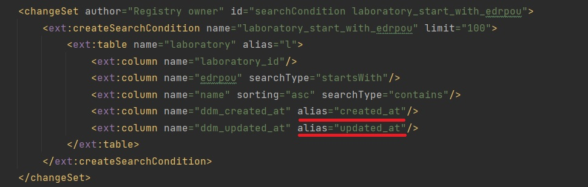

= Питання та відповіді

== Як отримати дату та час створення сутності у БД?

За фіксацію дати та часу додавання та оновлення сутності в БД відповідають системні поля `ddm_created_at` та `ddm_updated_at`.
Повернути цы параметри можливо за допомогою *search condition* вказавши їм `alias`.

